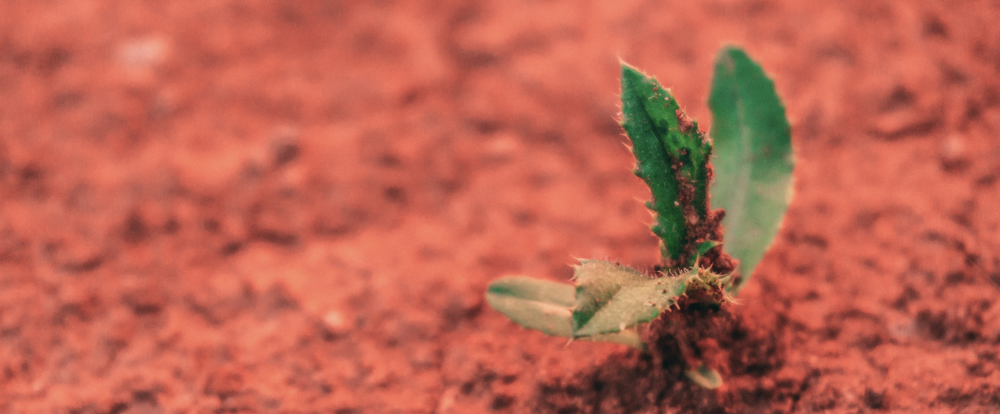

```{r setup, include=FALSE}
knitr::opts_chunk$set(echo = FALSE)

# Learn more about creating websites with Distill at:
# https://rstudio.github.io/distill/website.html

# Learn more about publishing to GitHub Pages at:
# https://rstudio.github.io/distill/publish_website.html#github-pages

```

```{r, out.width = "100%"}

# UPDATE IMAGE HERE 
# or copy/paste this code elsewhere, updating the file path, to add other images to your site!

```
<center><i><p style="font-size:12px">Image: a single green plant seedling in red soil. Photo by <a href="https://unsplash.com/@davidvondiemar?utm_source=unsplash&utm_medium=referral&utm_content=creditCopyText">David von Diemar</a> on <a href="https://unsplash.com/s/photos/seedling?utm_source=unsplash&utm_medium=referral&utm_content=creditCopyText">Unsplash</a></p></i></center>

## Syllabi

- [EDS 411A Syllabus](https://docs.google.com/document/d/1sFxgiRMTE7hEOj1L6GFAmmIPsdhGgslgrPdMpkRc2tY/edit?usp=sharing)
- [EDS 411B Syllabus](https://docs.google.com/document/d/1ASLqA12KhlT1e9_5FDB4DirnBeGVObfes0Ic93-MrfA/edit?usp=sharing)

## EDS 411B Student hours

Sign up for available 30-minute meetings at this [appointment page](https://calendar.google.com/calendar/u/0/selfsched?sstoken=UUxCQmlIb0JuUnlifGRlZmF1bHR8MGJhNjBhMmUxM2MwOGNhZjM4OGYwNGI5MWIwMzQ4MWI).

## Course description

The goal of EDS 411A is to facilitate student learning, work and progress on their MEDS Capstone project through lessons, activities, supervised and unsupervised project work, and peer review and feedback. Additionally, EDS 411A provides opportunities for professional and career development (e.g. presentation skills, writing and editing, client relations, team science, panel discussions, and conflict resolution). 

Throughout the course, students will build on skills they have learned in prior MEDS courses to implement them in a real-world data science project, including: 

- **Prepare professional documentation** for a data science project through the Design and Implementation Plan, and Technical Documentation

- **Practice project management and reproducible workflows** using tools and strategies learned in MEDS courses, establishing clear expectations for group roles and participation, and with frequent updates within and across groups

- **Continue to build real-world skills for data science projects** through continued collaborative work in git, data analyses and statistics, data visualization and communication, and more

- **Implement professional skills for data science careers** including code and documentation peer review, team and client relations, scheduling and organizing tools & strategies, and conflict resolution & communication

**Note:** Weeks 7 & 8 are practice presentations (for Faculty Reviews) and directed work on projects. Week 9 is Faculty Reviews. That's why there aren't shared materials for those weeks.


