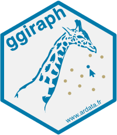

```{r setup, include=FALSE}
knitr::opts_chunk$set(echo = TRUE)
```

## EDS 411B Week 6:

-   [Slides](https://docs.google.com/presentation/d/e/2PACX-1vTz53tBztW-HYm7QEzyYjpERr4qMvS-h26xKlHzP8XSH1wE874vu1WoOeazVtD32fxOY4IbuADR206e/pub?start=false&loop=false&delayms=3000)

## Today:

-   1:00 - 1:15: Reminders, Q&A (& check times for [practice presentations](https://docs.google.com/spreadsheets/d/1dC73d9Q_M3GULyTy3SZVlAzOUmjmdBgxoREkCTrJ4iM/edit?usp=sharing))
-   1:15 - 1:45: Presentations, warming back up
-   1:45 - 2:00: Abstract for Public Presentations (due 5/13)
-   2:00 - 4:30: Dedicated work time + presentation check-ins
-   4:30 - 4:50: One cool thing - `ggiraph`

See the [Week 3 Slides](https://docs.google.com/presentation/d/e/2PACX-1vQ7PbHzE-tW7gCLDAS43wJ0P1WZCaJFsblkbdDkrQa_WF9lWwsueQ1vdhaJOBQAQZFIRk0cRx6FfpHJ/pub?start=false&loop=false&delayms=3000) for info on public presentations.

## `ggiraph` resources

-   [My demo repo](https://allisonhorst.github.io/ggiraph-demo/demo.html)
-   [`ggiraph` website](https://davidgohel.github.io/ggiraph/)

{width="20%"}

Today's "one cool thing" was inspired by [Dr. Alison Hill](https://www.apreshill.com/)!
